# Flujos de Navegación — Módulo Logístico Móvil del SGA

> **Proyecto:** Sistema de Gestión de Alquileres (SGA) — Fundiplacas Rodríguez
> **Fase:** 4 — Flujos de navegación (cerrada)
> **Fecha de consolidación:** 2026-11-21
> **Fuente:** Instrucción aprobada de consolidación documental del módulo logístico móvil

---

## 1. Estructura general de navegación

La navegación de la aplicación se organiza en tres niveles principales:

1. **Autenticación:** flujo de inicio de sesión (accesible sin sesión activa).
2. **Navegación principal:** acceso a los módulos funcionales (solo con sesión activa).
3. **Pantallas de detalle y operación:** accesibles desde la navegación principal.

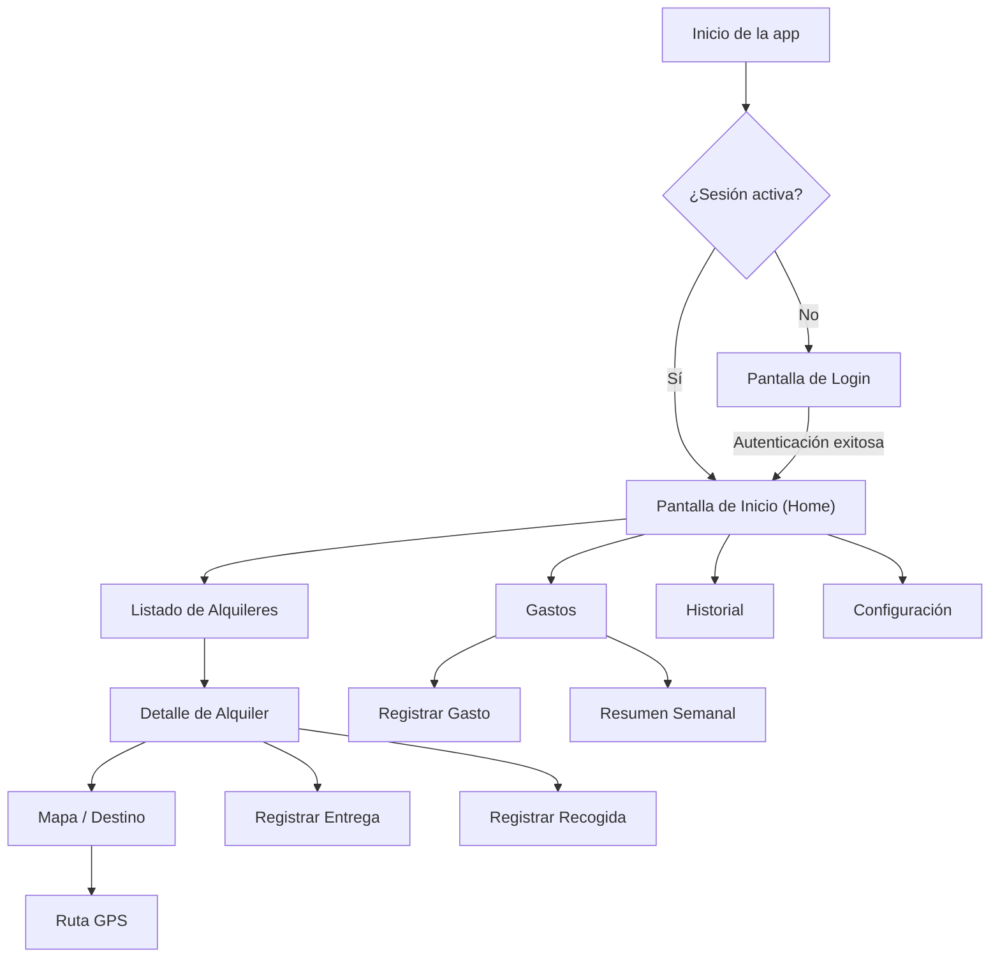
```mermaid
flowchart TD
    A["Inicio de la app"] --> B{"¿Sesión activa?"}
    B -->|"No"| C["Pantalla de Login"]
    B -->|"Sí"| D["Pantalla de Inicio (Home)"]
    C -->|"Autenticación exitosa"| D
    D --> E["Listado de Alquileres"]
    D --> F["Gastos"]
    D --> G["Historial"]
    D --> H["Configuración"]
    E --> I["Detalle de Alquiler"]
    I --> J["Mapa / Destino"]
    J --> K["Ruta GPS"]
    I --> L["Registrar Entrega"]
    I --> M["Registrar Recogida"]
    F --> N["Registrar Gasto"]
    F --> O["Resumen Semanal"]
```

---

## 2. Navegación principal

La navegación principal está disponible solo con sesión activa. Incluye acceso a:

- **Inicio (Home):** acceso rápido a las secciones principales.
- **Alquileres:** listado, búsqueda, filtros y detalle.
- **Gastos:** registro, consulta y resumen semanal.
- **Historial:** movimientos propios.
- **Configuración:** opciones de la aplicación (incluye cierre de sesión).

---

## 3. Inicio y autenticación

### 3.1 Inicio de la aplicación

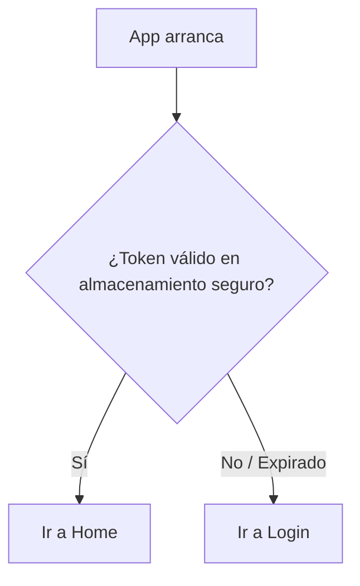
```mermaid
flowchart TD
    A["App arranca"] --> B{"¿Token válido en almacenamiento seguro?"}
    B -->|"Sí"| C["Ir a Home"]
    B -->|"No / Expirado"| D["Ir a Login"]
```

### 3.2 Inicio de sesión

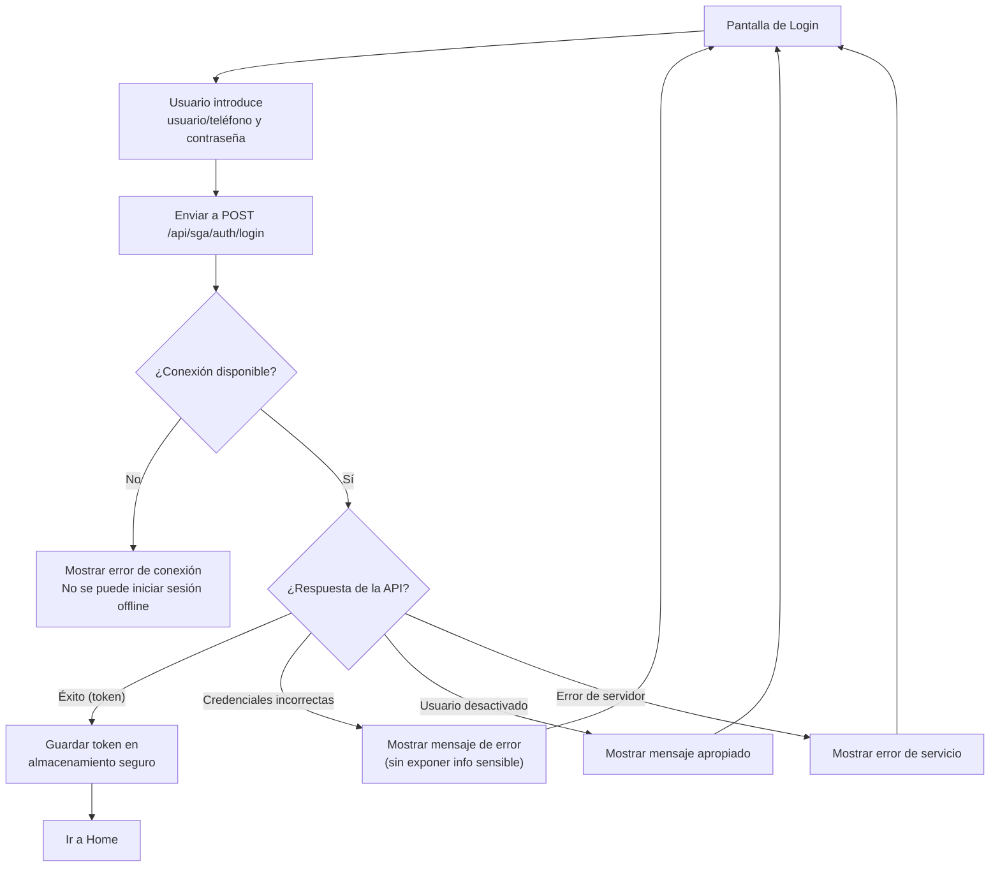
```mermaid
flowchart TD
    A["Pantalla de Login"] --> B["Usuario introduce\nusuario/teléfono y contraseña"]
    B --> C["Enviar a POST /api/sga/auth/login"]
    C --> D{"¿Conexión disponible?"}
    D -->|"No"| E["Mostrar error de conexión\nNo se puede iniciar sesión offline"]
    D -->|"Sí"| F{"¿Respuesta de la API?"}
    F -->|"Éxito (token)"| G["Guardar token en\nalmacenamiento seguro"]
    G --> H["Ir a Home"]
    F -->|"Credenciales incorrectas"| I["Mostrar mensaje de error\n(sin exponer info sensible)"]
    F -->|"Usuario desactivado"| J["Mostrar mensaje apropiado"]
    F -->|"Error de servidor"| K["Mostrar error de servicio"]
    I --> A
    J --> A
    K --> A
```

**Criterios de aceptación:**
- El login no está disponible en modo offline (requiere conexión).
- Los errores no exponen información sensible.
- Trazabilidad: HU-01.

### 3.3 Cierre de sesión

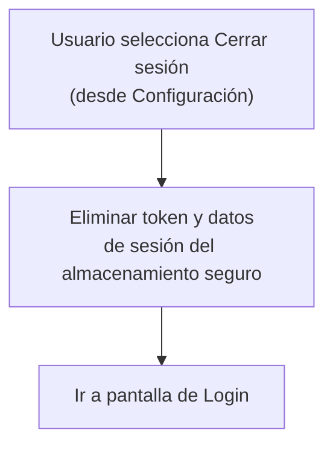
```mermaid
flowchart TD
    A["Usuario selecciona Cerrar sesión\n(desde Configuración)"] --> B["Eliminar token y datos\nde sesión del almacenamiento seguro"]
    B --> C["Ir a pantalla de Login"]
```

**Criterios de aceptación:**
- Se eliminan credenciales e información privada de la sesión del dispositivo.
- Trazabilidad: HU-01 (CA-6).

---

## 4. Configuración

La pantalla de configuración incluye al menos:
- Opción de cierre de sesión.
- Indicador del estado de conexión y sincronización.
- Opción de sincronización manual de operaciones pendientes.

---

## 5. Listado de alquileres

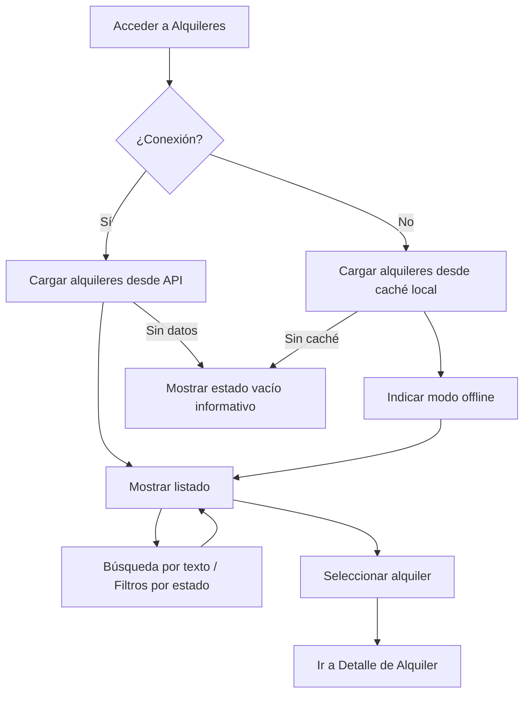
```mermaid
flowchart TD
    A["Acceder a Alquileres"] --> B{"¿Conexión?"}
    B -->|"Sí"| C["Cargar alquileres desde API"]
    B -->|"No"| D["Cargar alquileres desde caché local"]
    D --> E["Indicar modo offline"]
    C --> F["Mostrar listado"]
    E --> F
    F --> G["Búsqueda por texto / Filtros por estado"]
    G --> F
    F --> H["Seleccionar alquiler"]
    H --> I["Ir a Detalle de Alquiler"]
    C -->|"Sin datos"| J["Mostrar estado vacío informativo"]
    D -->|"Sin caché"| J
```

**Criterios de aceptación:**
- Trazabilidad: HU-02, HU-12.

### 5.1 Búsqueda y filtros

- Búsqueda por texto (identificador, nombre de cliente u otro criterio relevante).
- Filtros por estado del alquiler (al menos: pendiente, activo, vencido).
- Los filtros pueden combinarse con la búsqueda.

---

## 6. Detalle del alquiler

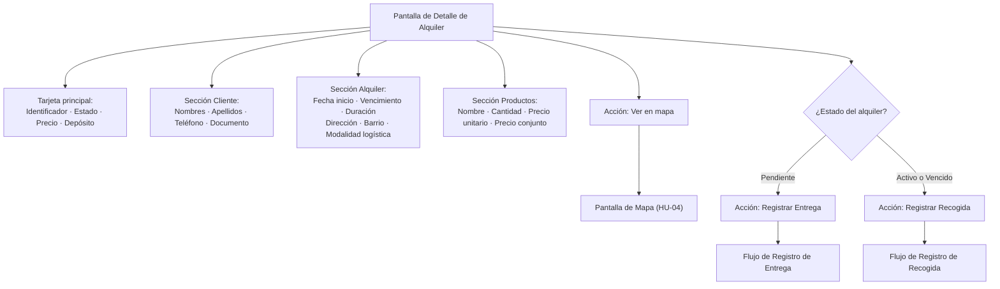
```mermaid
flowchart TD
    A["Pantalla de Detalle de Alquiler"] --> B["Tarjeta principal:\nIdentificador · Estado · Precio · Depósito"]
    A --> C["Sección Cliente:\nNombres · Apellidos · Teléfono · Documento"]
    A --> D["Sección Alquiler:\nFecha inicio · Vencimiento · Duración\nDirección · Barrio · Modalidad logística"]
    A --> E["Sección Productos:\nNombre · Cantidad · Precio unitario · Precio conjunto"]
    A --> F["Acción: Ver en mapa"]
    F --> G["Pantalla de Mapa (HU-04)"]
    A --> H{"¿Estado del alquiler?"}
    H -->|"Pendiente"| I["Acción: Registrar Entrega"]
    H -->|"Activo o Vencido"| J["Acción: Registrar Recogida"]
    I --> K["Flujo de Registro de Entrega"]
    J --> L["Flujo de Registro de Recogida"]
```

**Criterios de aceptación:**
- No se muestra el empleado que creó o gestionó el alquiler.
- Se muestra solo el estado actual, sin historial de movimientos.
- Contemplar modo claro y oscuro.
- Trazabilidad: HU-03.

---

## 7. Mapa

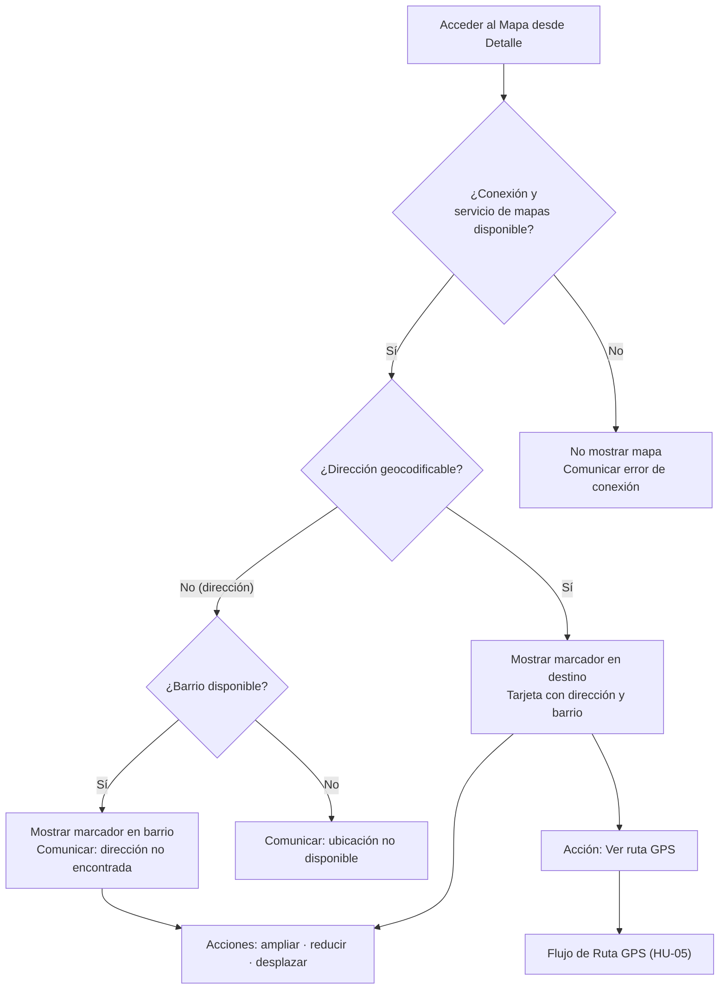
```mermaid
flowchart TD
    A["Acceder al Mapa desde Detalle"] --> B{"¿Conexión y\nservicio de mapas disponible?"}
    B -->|"Sí"| C{"¿Dirección geocodificable?"}
    C -->|"Sí"| D["Mostrar marcador en destino\nTarjeta con dirección y barrio"]
    C -->|"No (dirección)"| E{"¿Barrio disponible?"}
    E -->|"Sí"| F["Mostrar marcador en barrio\nComunicar: dirección no encontrada"]
    E -->|"No"| G["Comunicar: ubicación no disponible"]
    B -->|"No"| H["No mostrar mapa\nComunicar error de conexión"]
    D --> I["Acciones: ampliar · reducir · desplazar"]
    D --> J["Acción: Ver ruta GPS"]
    F --> I
    J --> K["Flujo de Ruta GPS (HU-05)"]
```

**Criterios de aceptación:**
- Si dirección y barrio no coinciden, la dirección tiene prioridad.
- El mapa permanece dentro de la aplicación (sin abrir apps externas).
- Trazabilidad: HU-04.

---

## 8. Ruta GPS

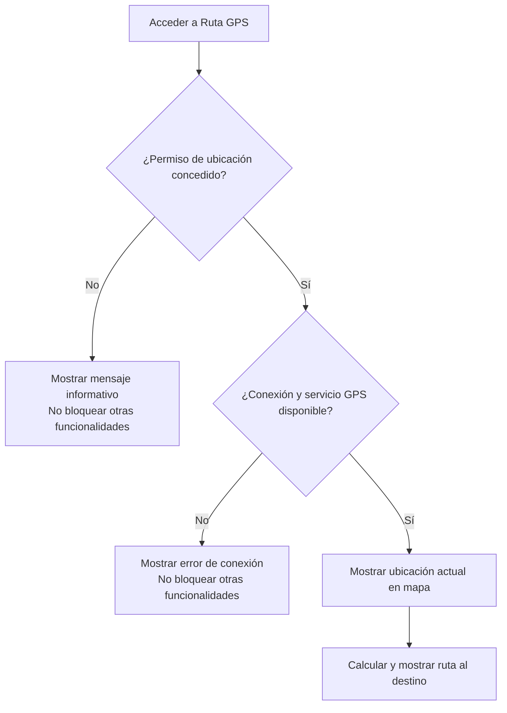
```mermaid
flowchart TD
    A["Acceder a Ruta GPS"] --> B{"¿Permiso de ubicación concedido?"}
    B -->|"No"| C["Mostrar mensaje informativo\nNo bloquear otras funcionalidades"]
    B -->|"Sí"| D{"¿Conexión y servicio GPS disponible?"}
    D -->|"No"| E["Mostrar error de conexión\nNo bloquear otras funcionalidades"]
    D -->|"Sí"| F["Mostrar ubicación actual en mapa"]
    F --> G["Calcular y mostrar ruta al destino"]
```

**Criterios de aceptación:**
- El permiso denegado no bloquea el resto de la aplicación.
- Trazabilidad: HU-05.

---

## 9. Entregas

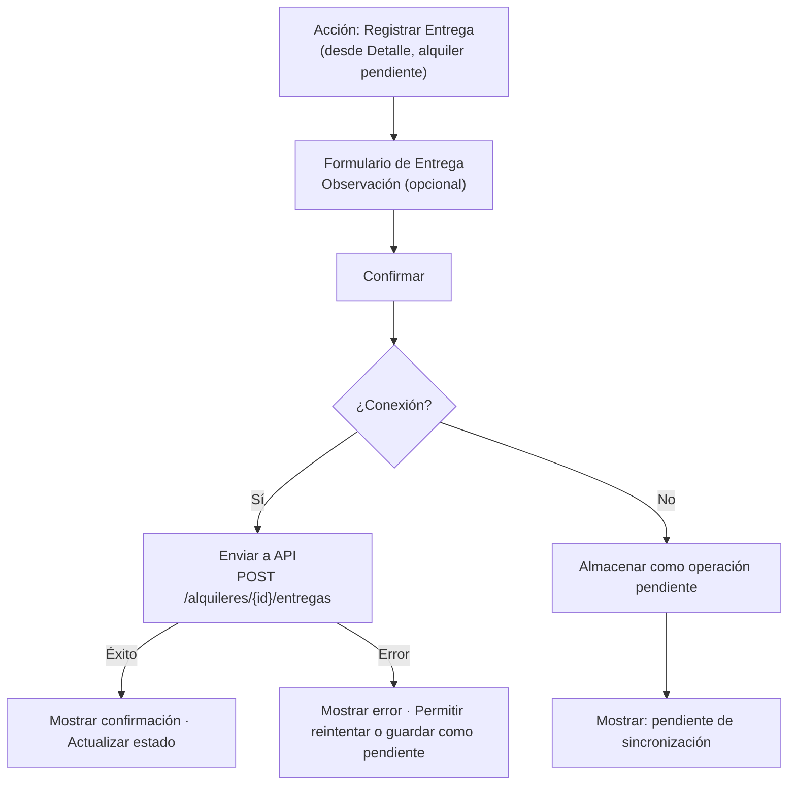
```mermaid
flowchart TD
    A["Acción: Registrar Entrega\n(desde Detalle, alquiler pendiente)"] --> B["Formulario de Entrega\nObservación (opcional)"]
    B --> C["Confirmar"]
    C --> D{"¿Conexión?"}
    D -->|"Sí"| E["Enviar a API\nPOST /alquileres/{id}/entregas"]
    D -->|"No"| F["Almacenar como operación pendiente"]
    E -->|"Éxito"| G["Mostrar confirmación · Actualizar estado"]
    E -->|"Error"| H["Mostrar error · Permitir reintentar o guardar como pendiente"]
    F --> I["Mostrar: pendiente de sincronización"]
```

**Criterios de aceptación:**
- La entrega es completa; no existe entrega parcial.
- No se solicitan datos del receptor.
- Fecha, hora y usuario se gestionan automáticamente.
- Trazabilidad: HU-06, HU-14, HU-17.

---

## 10. Recogidas

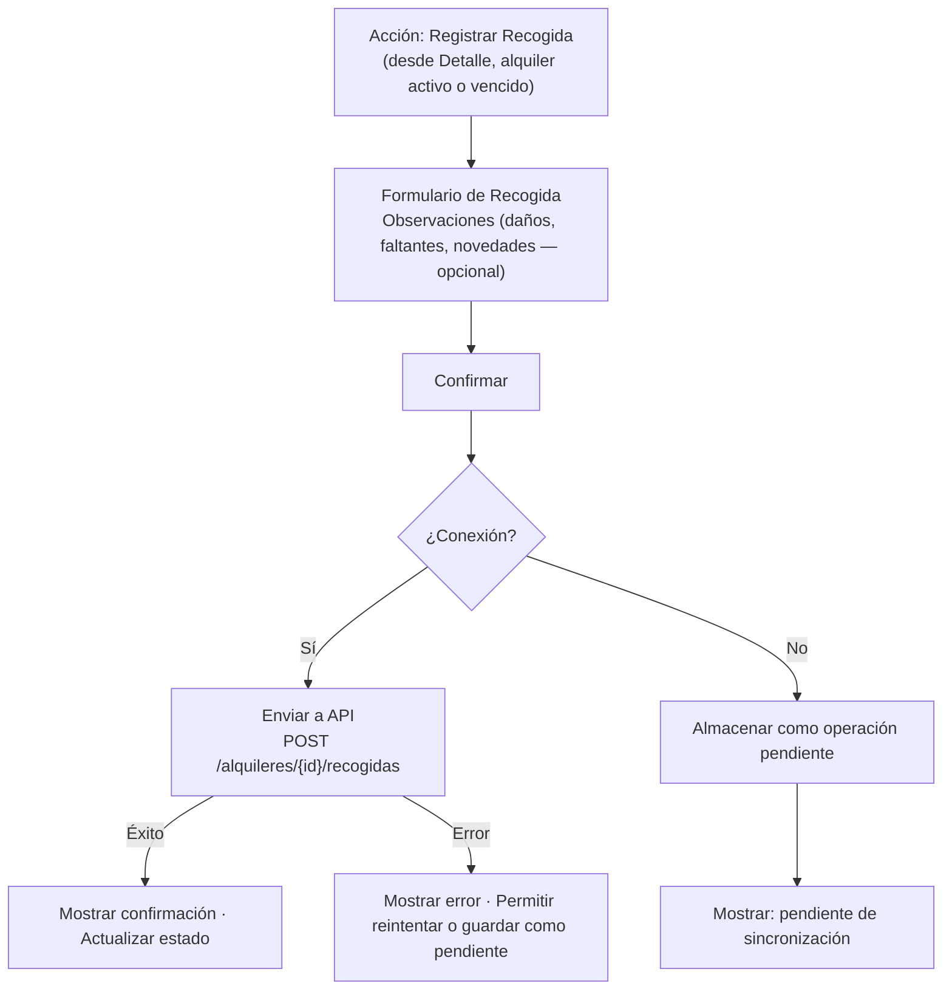
```mermaid
flowchart TD
    A["Acción: Registrar Recogida\n(desde Detalle, alquiler activo o vencido)"] --> B["Formulario de Recogida\nObservaciones (daños, faltantes, novedades — opcional)"]
    B --> C["Confirmar"]
    C --> D{"¿Conexión?"}
    D -->|"Sí"| E["Enviar a API\nPOST /alquileres/{id}/recogidas"]
    D -->|"No"| F["Almacenar como operación pendiente"]
    E -->|"Éxito"| G["Mostrar confirmación · Actualizar estado"]
    E -->|"Error"| H["Mostrar error · Permitir reintentar o guardar como pendiente"]
    F --> I["Mostrar: pendiente de sincronización"]
```

**Criterios de aceptación:**
- No se exige autorización previa de facturación.
- Los ajustes de inventario los gestiona el administrador; no desde la app.
- Trazabilidad: HU-07, HU-15, HU-18.

---

## 11. Gastos

### 11.1 Registro de gasto

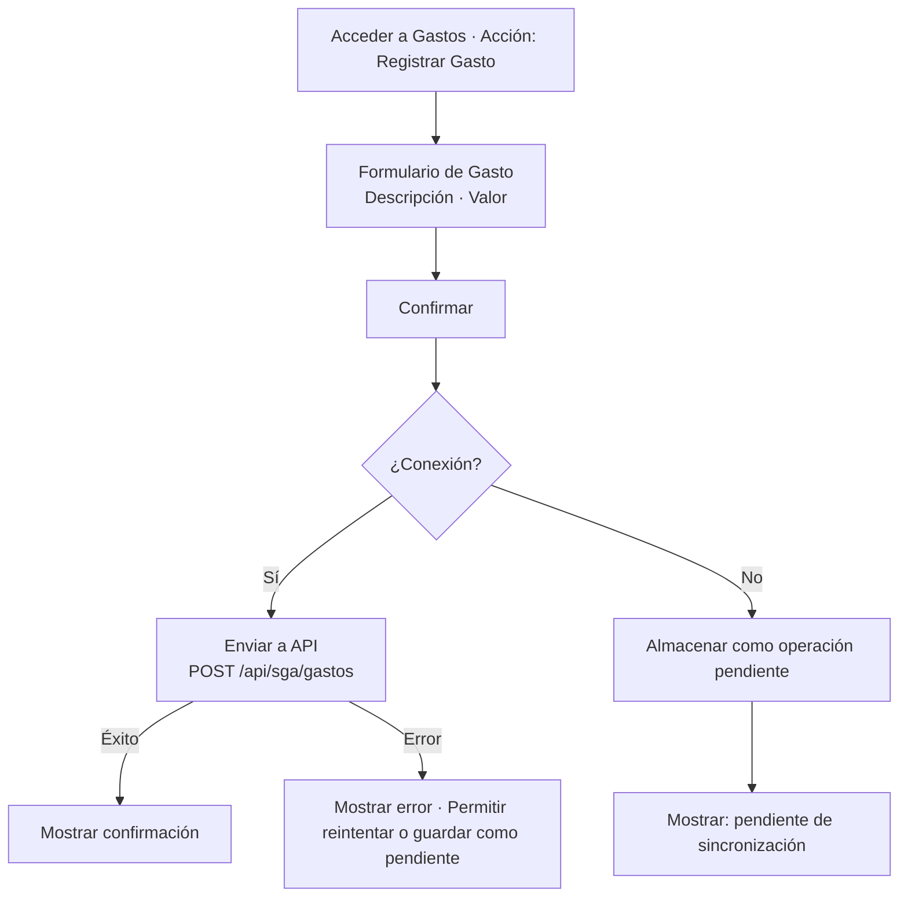
```mermaid
flowchart TD
    A["Acceder a Gastos · Acción: Registrar Gasto"] --> B["Formulario de Gasto\nDescripción · Valor"]
    B --> C["Confirmar"]
    C --> D{"¿Conexión?"}
    D -->|"Sí"| E["Enviar a API\nPOST /api/sga/gastos"]
    D -->|"No"| F["Almacenar como operación pendiente"]
    E -->|"Éxito"| G["Mostrar confirmación"]
    E -->|"Error"| H["Mostrar error · Permitir reintentar o guardar como pendiente"]
    F --> I["Mostrar: pendiente de sincronización"]
```

**Criterios de aceptación:**
- Sin categorías predefinidas obligatorias.
- Sin límite de gasto aprobado.
- El encargado logístico no edita ni elimina gastos.
- Trazabilidad: HU-08, HU-13, HU-16.

### 11.2 Consulta de gastos propios

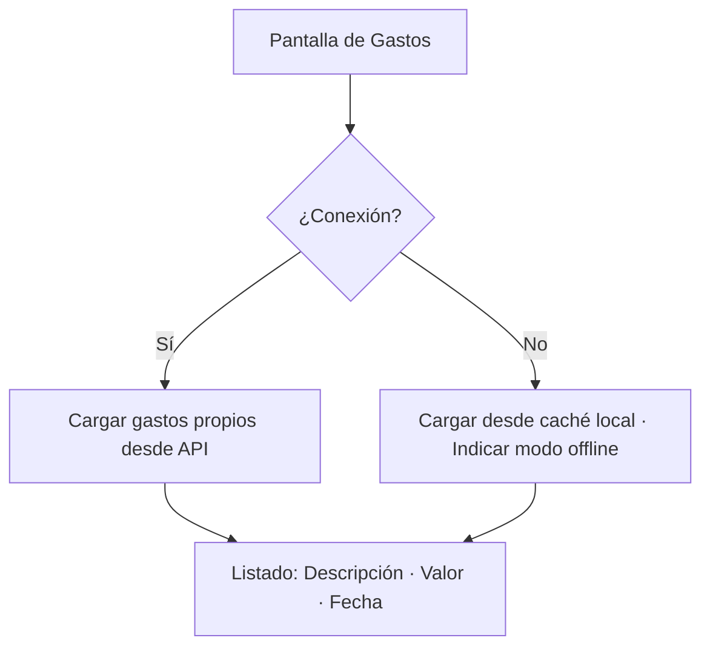
```mermaid
flowchart TD
    A["Pantalla de Gastos"] --> B{"¿Conexión?"}
    B -->|"Sí"| C["Cargar gastos propios desde API"]
    B -->|"No"| D["Cargar desde caché local · Indicar modo offline"]
    C --> E["Listado: Descripción · Valor · Fecha"]
    D --> E
```

**Criterios de aceptación:**
- Solo se muestran los gastos propios del encargado logístico autenticado.
- Trazabilidad: HU-09, HU-12.

### 11.3 Resumen semanal de gastos

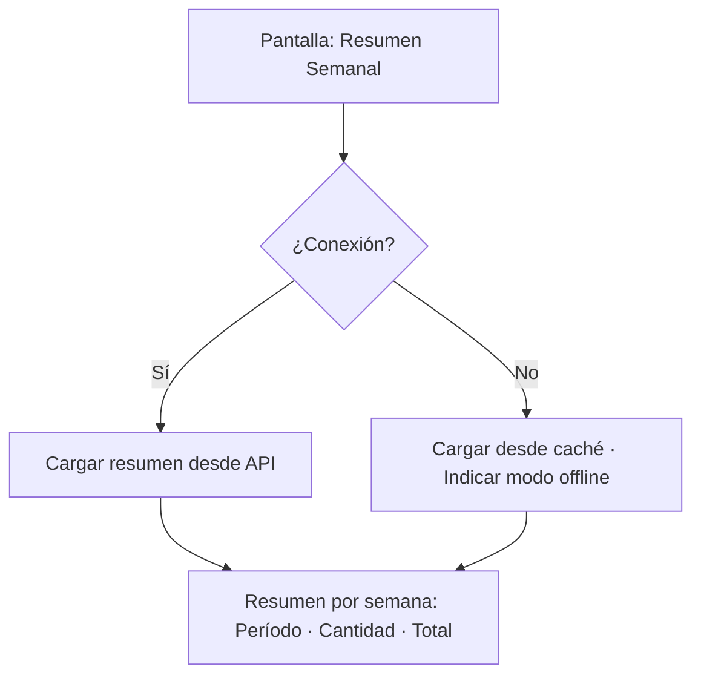
```mermaid
flowchart TD
    A["Pantalla: Resumen Semanal"] --> B{"¿Conexión?"}
    B -->|"Sí"| C["Cargar resumen desde API"]
    B -->|"No"| D["Cargar desde caché · Indicar modo offline"]
    C --> E["Resumen por semana: Período · Cantidad · Total"]
    D --> E
```

**Criterios de aceptación:**
- Trazabilidad: HU-10.
- ⚠️ Pendiente de validación técnica DEP-MOV-01: el endpoint actual está restringido a `ADMIN_O_FACTURACION`.

---

## 12. Historial

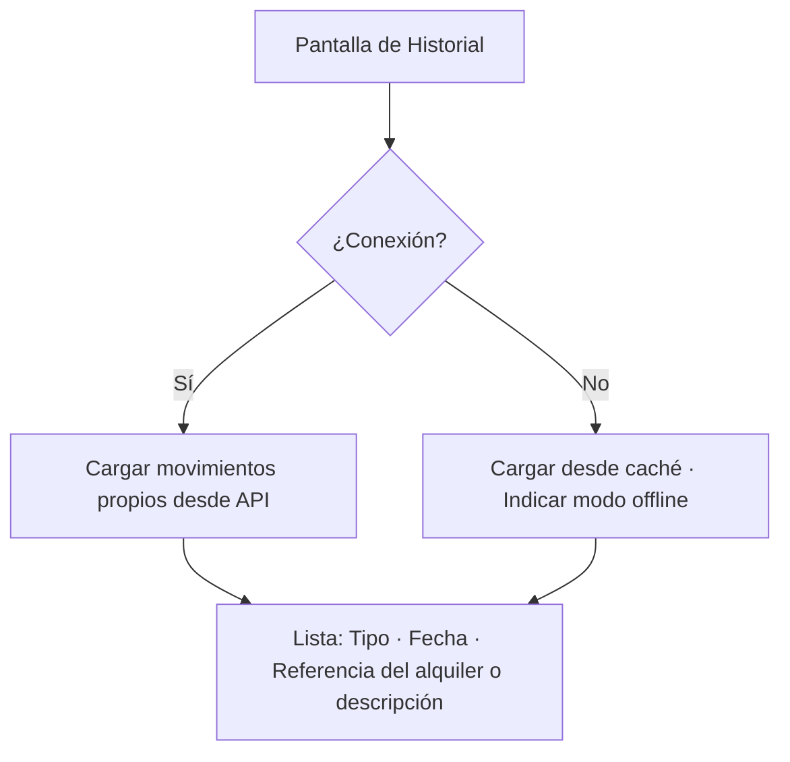
```mermaid
flowchart TD
    A["Pantalla de Historial"] --> B{"¿Conexión?"}
    B -->|"Sí"| C["Cargar movimientos propios desde API"]
    B -->|"No"| D["Cargar desde caché · Indicar modo offline"]
    C --> E["Lista: Tipo · Fecha · Referencia del alquiler o descripción"]
    D --> E
```

**Criterios de aceptación:**
- Solo se muestran movimientos propios del encargado logístico autenticado.
- Incluye entregas, recogidas y gastos.
- Trazabilidad: HU-11, HU-12.

---

## 13. Funcionamiento offline

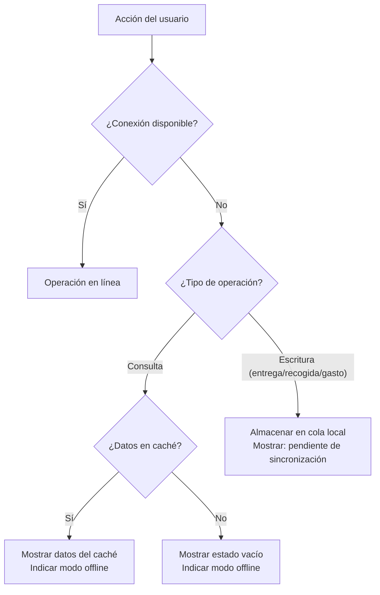
```mermaid
flowchart TD
    A["Acción del usuario"] --> B{"¿Conexión disponible?"}
    B -->|"Sí"| C["Operación en línea"]
    B -->|"No"| D{"¿Tipo de operación?"}
    D -->|"Consulta"| E{"¿Datos en caché?"}
    E -->|"Sí"| F["Mostrar datos del caché\nIndicar modo offline"]
    E -->|"No"| G["Mostrar estado vacío\nIndicar modo offline"]
    D -->|"Escritura (entrega/recogida/gasto)"| H["Almacenar en cola local\nMostrar: pendiente de sincronización"]
```

**Criterios de aceptación:**
- Se indica siempre cuando los datos provienen del caché.
- No se muestran datos falsos ni fabricados.
- Las operaciones offline persisten aunque se cierre la app.
- Trazabilidad: HU-12, HU-13, HU-14, HU-15.

---

## 14. Sincronización

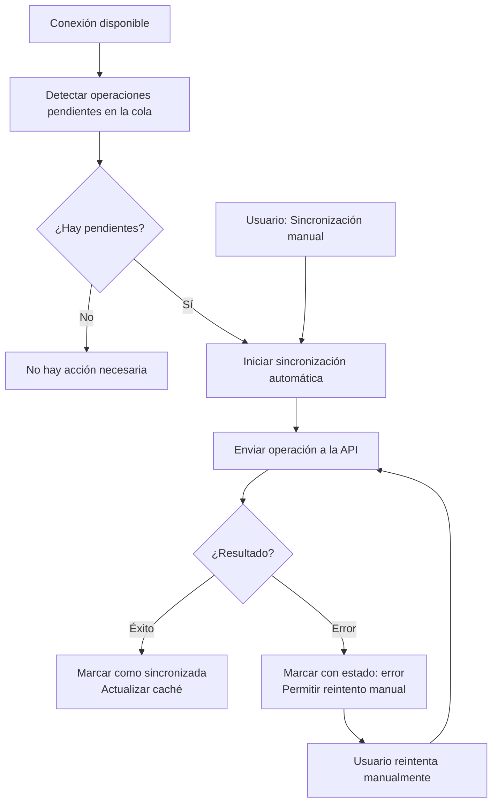
```mermaid
flowchart TD
    A["Conexión disponible"] --> B["Detectar operaciones pendientes en la cola"]
    B --> C{"¿Hay pendientes?"}
    C -->|"No"| D["No hay acción necesaria"]
    C -->|"Sí"| E["Iniciar sincronización automática"]
    E --> F["Enviar operación a la API"]
    F --> G{"¿Resultado?"}
    G -->|"Éxito"| H["Marcar como sincronizada\nActualizar caché"]
    G -->|"Error"| I["Marcar con estado: error\nPermitir reintento manual"]
    J["Usuario: Sincronización manual"] --> E
    I --> K["Usuario reintenta manualmente"]
    K --> F
```

**Criterios de aceptación:**
- Sincronización automática al recuperar conexión.
- Sincronización manual disponible en Configuración.
- Estado visible para cada operación (en espera / sincronizando / sincronizada / error).
- El encargado logístico puede reintentar manualmente operaciones con error.
- Trazabilidad: HU-16, HU-17, HU-18.

---

## 15. Estados de carga

Los estados de carga se muestran en las siguientes situaciones:

| Situación | Comportamiento |
|---|---|
| Cargando datos desde la API | Indicador de carga visible (spinner o skeleton) |
| Enviando operación a la API | Indicador de progreso; botón de acción desactivado para evitar duplicados |
| Sincronizando operaciones pendientes | Indicador de sincronización en progreso |
| Sin datos (ni en línea ni en caché) | Estado vacío informativo (mensaje descriptivo) |

---

## 16. Errores y excepciones

| Tipo de error | Comportamiento |
|---|---|
| Sin conexión a internet | Indicar claramente el estado offline; activar modo offline si hay caché |
| Error de autenticación (token expirado) | Redirigir a Login; no mostrar datos sensibles |
| Error de la API (500, timeout) | Mostrar mensaje descriptivo; ofrecer reintento si aplica |
| Error de servicio de mapas | No mostrar el mapa; comunicar el error; no bloquear otras funcionalidades |
| Error de sincronización | Mantener operación como pendiente; permitir reintento manual |
| Datos no encontrados (404) | Mostrar mensaje informativo; no bloquear otras pantallas |

---

## 17. Permisos

| Permiso | Uso | Comportamiento si se deniega |
|---|---|---|
| Ubicación (GPS) | Mostrar ubicación actual y calcular ruta (HU-05) | No bloquea la aplicación; funcionalidad de ruta no disponible; se muestra mensaje informativo |
| Almacenamiento (si aplica según plataforma) | Caché local y cola de operaciones pendientes | A gestionar en implementación según permisos del sistema operativo |

---

## 18. Criterios de aceptación globales de navegación

1. La navegación entre pantallas es fluida y coherente con las historias de usuario aprobadas.
2. El estado offline se indica claramente en todas las pantallas afectadas.
3. Las operaciones pendientes de sincronización son visibles para el encargado logístico.
4. Los errores se comunican de forma clara y sin exponer información técnica innecesaria.
5. Los permisos denegados no bloquean el acceso al resto de la aplicación.
6. Las pantallas contemplan modo claro y oscuro.
7. La orientación de uso es principalmente vertical.
8. La interfaz es legible y usable en pantallas pequeñas (dispositivos de gama baja y media).

---

## 19. Trazabilidad con historias de usuario

| Sección del documento | HU relacionadas |
|---|---|
| 3. Inicio y autenticación | HU-01 |
| 4. Configuración | HU-01, HU-16, HU-17, HU-18 |
| 5. Listado de alquileres | HU-02, HU-12 |
| 6. Detalle del alquiler | HU-03 |
| 7. Mapa | HU-04 |
| 8. Ruta GPS | HU-05 |
| 9. Entregas | HU-06, HU-14, HU-17 |
| 10. Recogidas | HU-07, HU-15, HU-18 |
| 11. Gastos | HU-08, HU-09, HU-10, HU-13, HU-16 |
| 12. Historial | HU-11, HU-12 |
| 13. Funcionamiento offline | HU-12, HU-13, HU-14, HU-15 |
| 14. Sincronización | HU-16, HU-17, HU-18 |

---

*Documento consolidado el 2026-11-21. Fase 4 cerrada.*
